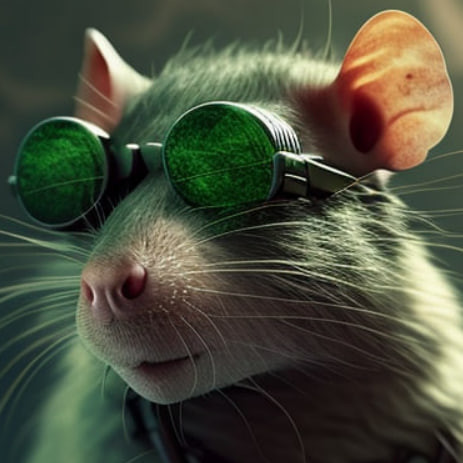

# LariskaBot - telegram-bot (Python, [aiogram](https://aiogram.dev/))

[](https://github.com/OldCodersClub/LariskaBot/stargazers)
[](https://github.com/OldCodersClub/LariskaBot/forks)
[](https://github.com/OldCodersClub/LariskaBot/watchers)
[](https://wakatime.com/@Voko/projects/xqfpkutwnj?start=2023-03-06&end=2023-03-12)

[](https://opensource.org/licenses/MIT)
[](https://github.com/OldCodersClub/LariskaBot/actions/workflows/deploy_to_vps.yml)
[](https://github.com/OldCodersClub/LariskaBot/tree/master)
[](https://github.com/OldCodersClub/LariskaBot/commits/master)

Телеграмм-бот для чата [@OldCodersClub](https://t.me/oldcodersclub)

[](https://t.me/oldcodersclub)

Бот использует приоритеты при поиске и генерации ответов для пользователей:

- фильтры (handler) aiogram (самый приоритетный)
- готовые ответы для конкретных пользователей (приветствие при первом сообщении пользователя, один раз за сутки)
- собственная база готовых ответов с использованием [FuzzyWuzzy](https://pypi.org/project/fuzzywuzzy/) (расстояние Левенштейна) для нечёткого сопоставления вопросов и ответов (настроен на 80% совпадение)
- [OpenAI API](https://platform.openai.com/docs/api-reference/) (срабатывает только если обратиться к боту по имени)

Любой ниже расположенный фильтр срабатывает, только если были пропущены все расположенные выше.

### Запуск в Докере

Создать и запустить контейнер:

```bash
$ export BOT_TOKEN=<BOT_TOKEN>
$ export AI_KEY=<AI_KEY>
$ export VCHAT_ID=<VCHAT_ID>
$ export DCHAT_ID=<DCHAT_ID>
$ export SCHAT_ID=<SCHAT_ID>
$ docker-compose up -d
```

Остановить запущенный контейнер:

```bash
$ docker-compose stop
```

Запустить остановленный контейнер:

```bash
$ docker-compose start
```

Остановить и удалить контейнер и сеть:

```bash
$ docker-compose down
```

Удалить докер-образ:

```bash
$ docker rmi lariska_bot
```

Очистить логи:

```bash
$ sudo rm -rf logs/*
```

### [Пустой шаблон для деплоя](https://railway.app/template/-S3lVz?referralCode=jUyx2Z)

[](https://railway.app/template/-S3lVz?referralCode=jUyx2Z)

#### Переменные

- `BOT_TOKEN` - токен Telegram-бота
- `CHAT_ID` - ID чата, в котором разрешено работать боту.
- `AI_KEY` - OpenAI API токен
- `DOMAIN` - URL-адрес с названием приложения. После развертывания перейдите в настройки проекта (`Settings`) и скопируйте домен из раздела `Domains`. Это должно быть похоже на `worker-production-XXXX.up.railway.app`. Это и будет значение для переменной `DOMAIN`.
